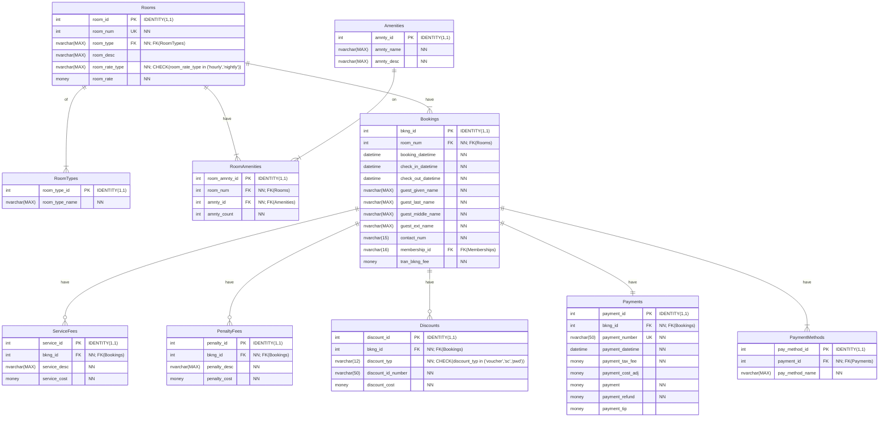

# Database Design

```mermaid
erDiagram
    Rooms {
        int room_id PK "IDENTITY(1,1)"
        int room_num UK "NN"
        nvarchar(MAX) room_type FK "NN; FK(RoomTypes)"
        nvarchar(MAX) room_desc
        nvarchar(MAX) room_rate_type "NN; CHECK(room_rate_type in ('hourly','nightly'))"
        money room_rate "NN"
    }
    RoomTypes {
        int room_type_id PK "IDENTITY(1,1)"
        nvarchar(MAX) room_type_name "NN"
    }
    Amenities {
        int amnty_id PK "IDENTITY(1,1)"
        nvarchar(MAX) amnty_name "NN"
        nvarchar(MAX) amnty_desc "NN"
    }
    RoomAmenities {
        int room_amnty_id PK "IDENTITY(1,1)"
        int room_num FK "NN; FK(Rooms)"
        int amnty_id FK "NN; FK(Amenities)"
        int amnty_count "NN"
    }
    Bookings {
        int bkng_id PK "IDENTITY(1,1)"
        int room_num FK "NN; FK(Rooms)"
        datetime booking_datetime "NN"
        datetime check_in_datetime "NN"
        datetime check_out_datetime "NN"
        nvarchar(MAX) guest_given_name "NN"
        nvarchar(MAX) guest_last_name "NN"
        nvarchar(MAX) guest_middle_name "NN"
        nvarchar(MAX) guest_ext_name "NN"
        nvarchar(15) contact_num "NN"
        nvarchar(16) membership_id FK "FK(Memberships)"
        money tran_bkng_fee "NN"
    }
    ServiceFees {
        int service_id PK "IDENTITY(1,1)"
        int bkng_id FK "NN; FK(Bookings)"
        nvarchar(MAX) service_desc "NN"
        money service_cost "NN"
    }
    PenaltyFees {
        int penalty_id PK "IDENTITY(1,1)"
        int bkng_id FK "NN; FK(Bookings)"
        nvarchar(MAX) penalty_desc "NN"
        money penalty_cost "NN"
    }
    Discounts {
        int discount_id PK "IDENTITY(1,1)"
        int bkng_id FK "NN; FK(Bookings)"
        nvarchar(12) discount_typ "NN; CHECK(discount_typ in ('voucher','sc','pwd'))"
        nvarchar(50) discount_id_number "NN"
        money discount_cost "NN"
    }
    Payments {
        int payment_id PK "IDENTITY(1,1)"
        int bkng_id FK "NN; FK(Bookings)"
        nvarchar(50) payment_number UK "NN"
        datetime payment_datetime "NN"
        money payment_tax_fee "NN"
        money payment_cost_adj
        money payment "NN"
        money payment_refund "NN"
        money payment_tip
    }
    PaymentMethods {
        int pay_method_id PK "IDENTITY(1,1)"
        int payment_id FK "NN; FK(Payments)"
        nvarchar(MAX) pay_method_name "NN"
    }
    Rooms ||--|{ RoomTypes : of
    Rooms ||--|{ RoomAmenities : have
    Amenities ||--|{ RoomAmenities : on
    Rooms ||--|{ Bookings : have
    Bookings ||--o{ ServiceFees : have
    Bookings ||--o{ PenaltyFees : have
    Bookings ||--o{ Discounts : have
    Bookings ||--|| Payments : have
    Bookings ||--|{ PaymentMethods : have
```