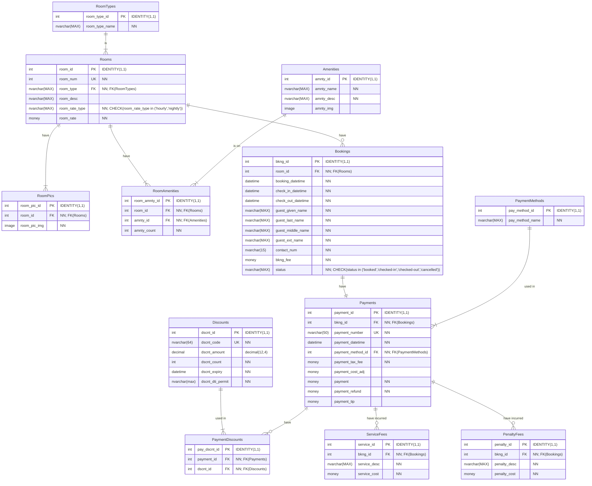

# Database Design

```mermaid
erDiagram
    Rooms {
        int room_id PK "IDENTITY(1,1)"
        int room_num UK "NN"
        nvarchar(MAX) room_type FK "NN; FK(RoomTypes)"
        nvarchar(MAX) room_desc
        nvarchar(MAX) room_rate_type "NN; CHECK(room_rate_type in ('hourly','nightly'))"
        money room_rate "NN"
    }
    RoomPics{
        int room_pic_id PK "IDENTITY(1,1)"
        int room_id FK "NN; FK(Rooms)"
        image room_pic_img "NN"
    }
    RoomTypes {
        int room_type_id PK "IDENTITY(1,1)"
        nvarchar(MAX) room_type_name "NN"
    }
    Amenities {
        int amnty_id PK "IDENTITY(1,1)"
        nvarchar(MAX) amnty_name "NN"
        nvarchar(MAX) amnty_desc "NN"
        image amnty_img
    }
    RoomAmenities {
        int room_amnty_id PK "IDENTITY(1,1)"
        int room_id FK "NN; FK(Rooms)"
        int amnty_id FK "NN; FK(Amenities)"
        int amnty_count "NN"
    }
    Bookings {
        int bkng_id PK "IDENTITY(1,1)"
        int room_id FK "NN; FK(Rooms)"
        datetime booking_datetime "NN"
        datetime check_in_datetime "NN"
        datetime check_out_datetime "NN"
        nvarchar(MAX) guest_given_name "NN"
        nvarchar(MAX) guest_last_name "NN"
        nvarchar(MAX) guest_middle_name "NN"
        nvarchar(MAX) guest_ext_name "NN"
        nvarchar(15) contact_num "NN"
        money bkng_fee "NN"
        nvarchar(MAX) status "NN; CHECK(status in ('booked','checked-in','checked-out','cancelled'))"
    }
    ServiceFees {
        int service_id PK "IDENTITY(1,1)"
        int bkng_id FK "NN; FK(Bookings)"
        nvarchar(MAX) service_desc "NN"
        money service_cost "NN"
    }
    PenaltyFees {
        int penalty_id PK "IDENTITY(1,1)"
        int bkng_id FK "NN; FK(Bookings)"
        nvarchar(MAX) penalty_desc "NN"
        money penalty_cost "NN"
    }
    Discounts {
        int dscnt_id PK "IDENTITY(1,1)"
        nvarchar(64) dscnt_code UK "NN"
        decimal dscnt_amount "decimal(12,4)"
        int dscnt_count "NN"
        datetime dscnt_expiry "NN"
        nvarchar(max) dscnt_dti_permit "NN"
    }
    Payments {
        int payment_id PK "IDENTITY(1,1)"
        int bkng_id FK "NN; FK(Bookings)"
        nvarchar(50) payment_number UK "NN"
        datetime payment_datetime "NN"
        int payment_method_id FK "NN; FK(PaymentMethods)"
        money payment_tax_fee "NN"
        money payment_cost_adj
        money payment "NN"
        money payment_refund "NN"
        money payment_tip
    }
    PaymentDiscounts {
        int pay_dscnt_id PK "IDENTITY(1,1)"
        int payment_id FK "NN; FK(Payments)"
        int dscnt_id FK "NN; FK(Discounts)"
    }
    PaymentMethods {
        int pay_method_id PK "IDENTITY(1,1)"
        nvarchar(MAX) pay_method_name "NN"
    }
    RoomTypes ||--|{ Rooms  : "is"
    Rooms ||--|{ RoomAmenities : "have"
    Rooms ||--|{ RoomPics : "have"
    Amenities ||--|{ RoomAmenities : "is on"
    Rooms ||--o{ Bookings : "have"
    Bookings ||--|| Payments : "have"
    Discounts ||--|{ PaymentDiscounts : "used in"
    Payments ||--o{ PaymentDiscounts : "have"
    Payments ||--o{ ServiceFees : "have incurred"
    Payments ||--o{ PenaltyFees : "have incurred"
    PaymentMethods ||--|{ Payments  : "used in"
```